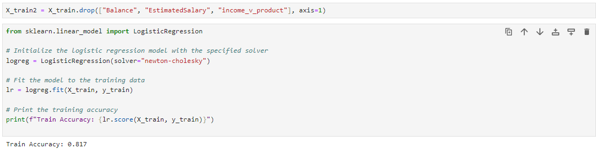

# 📊 **Bank Churn Analysis (Classification)**

## 📝 **Project Overview**  
In this project, I took on the role of a **Data Scientist** for the Bank of Mavenland. The objective was to help reduce customer churn by identifying clients at the highest risk of leaving. By leveraging data analysis and machine learning techniques, I built classification models to predict customer churn and provide insights for targeted retention strategies.

## 🎯 **Assignment Goals**  
The bank's product team aimed to increase revenue by minimizing churn rates. To achieve this, I developed a classification model capable of identifying high-risk customers, enabling the business to proactively address potential churn.

## 🚀 **Project Objectives**  

1. **Data Exploration**: Load and explore the dataset to understand patterns and anomalies.  

2. **Data Preparation**: Clean and preprocess the data for optimal model performance.  

3. **Model Building**:  
    - Develop and evaluate a **Logistic Regression** model.  
    - Build and fine-tune a **Random Forest** model.  

4. **Model Evaluation**: Compare model performance and select the best approach for identifying churn-prone customers.

## 🛠️ **Technologies Used**  

- **Python**  
- **Pandas**  
- **Scikit-Learn**  
- **Matplotlib / Seaborn**  
- **Jupyter Notebook**

## 📈 **Results**  
The project delivers a comprehensive analysis and predictive models that can identify customers at high risk of churn, helping the bank take data-driven actions to improve customer retention.

## 🚀 **Objective 1: Profile & Explore the Data**

The first objective is to import the data and explore relationships between the features and the target variable.

1. **Import the `Churn_Modeling.csv` file** and set an **appropriate data type** for each column.  
 
   
    <!--   Customize size -->

3. **Check for missing values** and calculate the **min, max, and mean** for numeric columns.  
   

4. **Build a scatterplot matrix** to find relationships between all pairs of numeric columns.  
   

5. **Build box plots** for each numeric column broken out by the target variable, **“Exited”**.  
   

6. **Build bar charts** that show the percentage of **“Exited”** by category for each categorical column.  
   

## 🚀 **Objective 2: Prepare the data for modeling**

The second objective is to prepare the data for modeling through feature selection, feature engineering, and data splitting.

1.  - Drop columns that aren’t suitable for modeling from the dataset. 
    - Create a new column, “balance_to_income”, by dividing “Balance” by “EstimatedSalary”.
    - Create a new column, “income_v_products”, by dividing “EstimatedSalary” by “NumOfProducts”
 
   

2.  - Create dummy variables for categorical columns
    - Split the data into train and test sets, with 20% of the rows in the test set
  
   

## 🚀 **Objective 3: Build & evaluate a logistic regression model**

The third objective is to fit a logistic regression model and evaluate it by using a confusion matrix, ROC curve, and precision & recall.

1.  Fit a logistic regression model on your training data
    
    
2.  Build a confusion matrix to evaluate your model
    

3.  Calculate accuracy, precision, recall, and F1 for your test data
    

4.  Plot an ROC curve and calculate the AUC statistic
    

5.  Plot precision and recall against the model threshold (set the threshold to the value where recall is the highest, but precision is still above 50%)
    
    

## 🚀 **Objective 4: Fit & tune a random forest model**

The final objective is to fit a random forest model, tune it using cross validation, and evaluate test accuracy, AUC score, and feature importance.

1.  Fit a random forest model with default hyperparameters
    

2.  Use cross validation to tune your model's hyperparameters
    
    

3.  Report the final test accuracy and AUC score
    
    

5.  Build a bar chart that shows feature importance
    
